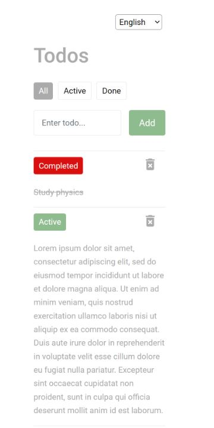

# TodoApp

A simple Todo Application. The user can add, delete todo and mark a todo as completed or active.

This project was generated with [Angular CLI](https://github.com/angular/angular-cli) version 11.2.1.

Data is stored in local storage.

# Styling
Custom CSS, Angular Material for icons.

# Mobile view
Supported

# i18N
Supports English and Estonian.

Implemented using ngx-translate.

# Setup
* Clone this project to your IDE. 

* Run npm install to install Node modules.

## Development server

Run `ng serve` for a dev server. Navigate to `http://localhost:4200/`. The app will automatically reload if you change any of the source files.

## Running unit tests

Run `ng test` to execute the unit tests via [Karma](https://karma-runner.github.io).

# Browser view

# Mobile view

